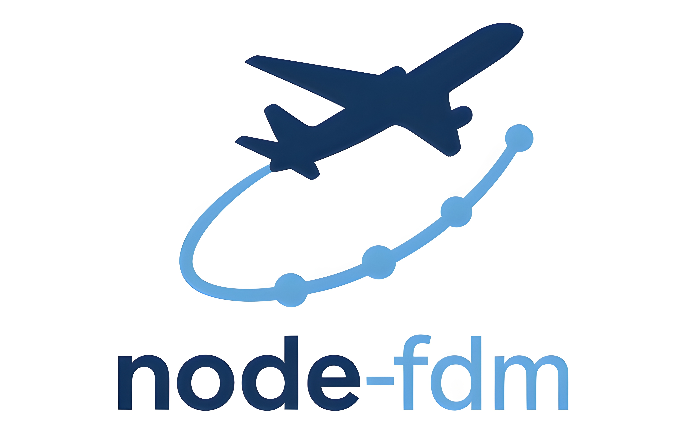

<p align="center">
  
</p>
<p align="center">
  <em>Neural Ordinary Differential Equation (Neural ODE) model for aircraft flight dynamics</em>
</p>

---

### ✈️ Overview
**node-fdm** implements a physics-guided Neural ODE framework for learning and simulating aircraft flight dynamics.  
It combines **data-driven learning** with **physical consistency**, enabling the reproduction of vertical motion and energy exchanges during flight.

---

### ⚖️ Important Legal & Usage Notes
- Distributed under the **EUPL-1.2** licence, with exceptions detailed in `AMENDMENT_TO_EUPL_license.md`, reflecting EUROCONTROL’s status as an international organisation.  
- <ins>**This repository is provided for research purposes only and does not constitute a regulatory framework.**</ins>  
  EUROCONTROL disclaims any responsibility for misuse or operational application of these models.

---


### 📁 Repository Structure

```text
├── code/                     # Scripts to download, preprocess, train and evaluate models
├── node_fdm/                 # Core Neural ODE implementation and training utilities
├── preprocessing/            # Data preparation and meteorological enrichment modules
├── pybada_predictor/         # Basine performance models using BADA
├── models/                   # Trained model checkpoints (per aircraft type)
├── data/                     # Input and output data (raw, preprocessed, ERA5 cache)
├── figures/                  # Generated figures from the paper (performance & trajectories)
├── utils/                    # Helper functions for metrics, data handling and physics
└── config.py                 # Global configuration file
```

---

### 🎨 Use Case:

- #### OpenSky Symposium 2025 — ADS-B Models

*Jarry, G. & Olive, X. (2025). "Generation of Vertical Profiles with Neural Ordinary Differential Equations Trained on Open Trajectory Data," Journal of Open Aviation Science, Proceedings of the 13th OpenSky Symposium.*

This repository enables **full reproducibility** of the study. All code used to **download and preprocess the data**, **train the models**, **perform trajectory inference**, and **generate the figures** presented in the paper is provided here.

- #### SESAR Innovation Days 2025 — QAR Model

*Jarry, G., Dalmau, R., Olive, X., & Very, P. (2025). "A Neural ODE Approach to Aircraft Flight Dynamics Modelling,"*  
*Proceedings of the SESAR Innovation Days 2025, arXiv:2509.23307.*

For the QAR-based model, the repository provides the **full training pipeline**,  the **complete model implementation**, the **inference scripts**, and the **final trained model weights**.  

⚠️ Due to proprietary restrictions, the **QAR datasets themselves cannot be released**; only the model, code, and weights are included.


---

### 🚧 Work in Progress

This repository is under active development. Future updates will include:

- Improve **Mode S feature reconstruction** to reduce errors in training and evaluation  
- Extend to **lateral dynamics** for full trajectory generation and enhanced speed modelling  
- Incorporate stronger **physical constraints** through physics-based loss regularization  
- Train models to **complete ADS-B data** or **generate trajectories** directly from flight plans  

---

### 🤝 Community — Adding a New Architecture

Community feedback and contributions are welcome to help advance the model’s robustness and applicability.

Want to extend the library with another dataset or modelling choice? Use the existing `opensky_2025` and `qar` packages as templates:

1) **Copy a package skeleton**: duplicate `node_fdm/architectures/opensky_2025` (minimal) or `node_fdm/architectures/qar` (multi-layer example) into a new folder `node_fdm/architectures/<your_arch>`, keep the same file names (`columns.py`, `flight_process.py`, `model.py`, extra layers as needed).
2) **Declare columns**: in `columns.py`, define your state (`X_COLS`), control (`U_COLS`), exogenous (`E0_COLS`), and extra outputs, following the existing column objects. Keep derivative columns for ODE targets.
3) **Build layers**: in `model.py`, wire your layers (e.g., `TrajectoryLayer`, `EngineLayer`, `StructuredLayer`) and expose `ARCHITECTURE` and `MODEL_COLS`. The OpenSky model shows a two-layer baseline; QAR illustrates stacking several derived layers.
4) **Preprocess & filter**: implement `flight_processing` and `segment_filtering` in `flight_process.py` to clean/augment your raw data (see altitude diffs in OpenSky vs. smoothing and engine reduction in QAR).
5) **Register the name**: add your architecture key to `valid_names` in `node_fdm/architectures/mapping.py` so loaders and training scripts can find it.
6) **Test a small run**: train or run inference on a tiny slice to validate column ordering and tensor shapes before opening a pull request; sample pipelines live in `code/` (e.g., OpenSky scripts).

If you contribute back, include a short note on your data assumptions, any proprietary constraints, and a minimal script/notebook that exercises the new architecture.
