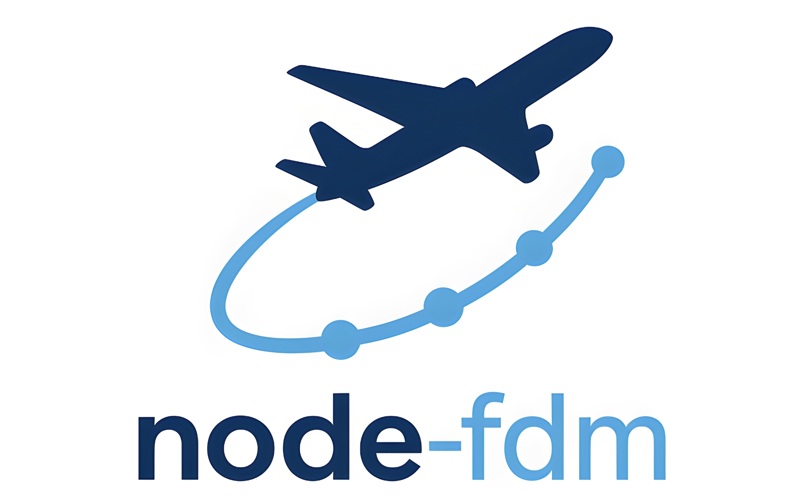

<div align="center">
  

  <br /><br />

  <em>A physics-guided Neural Ordinary Differential Equation (Neural ODE) framework for aircraft flight dynamics simulation and learning.</em>

  <br /><br />

  <a href="https://github.com/eurocontrol-asu/node-fdm-v2/actions/workflows/ci.yml"></a>
  
  
  <a href="https://github.com/astral-sh/ruff"></a>
  <a href="https://github.com/astral-sh/uv"></a>
  

  <br /><br />

  <p>
    <a href="#-overview">Overview</a> •
    <a href="#-experiment-pipeline">Pipeline</a> •
    <a href="#packages">Packages</a> •
    <a href="#-reproducing-paper-v1">Reproduce</a> •
    <a href="#-use-cases--publications">Publications</a> •
    <a href="#-contributing">Contributing</a>
  </p>
</div>

---

### 📚 Documentation

**Full documentation, tutorials, and API reference available at:** 👉 **[eurocontrol-asu.github.io/node-fdm-v2](https://eurocontrol-asu.github.io/node-fdm-v2/)**

---

### ✈️ Overview

**node-fdm-v2** is a clean-room rebuild of [eurocontrol-asu/node-fdm](https://github.com/eurocontrol-asu/node-fdm) using modern standards: **Polars** (replaces pandas), **Pydantic v2** (replaces raw dicts), **structlog** (replaces print), and a **typed architecture registry**.

It allows researchers to:
* 📉 **Reconstruct** coherent trajectories from sparse ADS-B or QAR data
* 🎮 **Simulate** aircraft behavior using learned latent dynamics
* 📊 **Benchmark** against physical models like BADA

---

### 🔀 Branch Strategy

| Branch | Purpose |
|---|---|
| **`main`** | Active development — v2 with longitudinal + lateral dynamics |
| **`legacy`** | Frozen snapshot of the v1 code used in the OpenSky 2025 paper (longitudinal only) |

The original codebase lives at [eurocontrol-asu/node-fdm](https://github.com/eurocontrol-asu/node-fdm). This repository (`node-fdm-v2`) is a clean-room rebuild.

---

### 📄 Reproducing Paper v1

To reproduce the experiments from the **OpenSky Symposium 2025** paper:

```bash
# Clone the original repository
git clone https://github.com/eurocontrol-asu/node-fdm.git
cd node-fdm

# Switch to the frozen v1 branch
git checkout legacy

# Follow the instructions in that branch's README
```

> [!NOTE]
> The `legacy` branch uses **pandas**, raw `dict` configs, and the original script-based pipeline.
> The `main` branch of `node-fdm-v2` uses **Polars**, **Pydantic**, and the `fdm` CLI.

---

### 🔬 Experiment Pipeline

The v2 experiment pipeline is driven entirely through the `fdm` CLI.
All commands take a `config.yaml` as first argument (see **[Configure Project](https://eurocontrol-asu.github.io/node-fdm-v2/howto/configure_params/)**).

```bash
# 1. Data acquisition
fdm aircraft-list --config config.yaml    # List aircraft types in scope
fdm download --config config.yaml         # Download ADS-B parquet from OpenSky

# 2. Preprocessing
fdm preprocess --config config.yaml       # Clean, filter, unit-convert raw data
fdm identify --config config.yaml         # Segment flights and attach metadata

# 3. Quality flagging
fdm flag --config config.yaml             # Add fdm_flag_* validity columns (no rows deleted)

# 4. Processing (ERA5, segments, lateral)
fdm process --arch opensky --config config.yaml  # Weather + derived columns + lateral augmentation

# 5. Training
fdm train --config config.yaml            # Train Neural ODE model

# 6. Evaluation
fdm predict --config config.yaml          # Run model predictions
fdm predict-bada --config config.yaml     # BADA 4.2 physical baseline
fdm evaluate --config config.yaml         # Compute MAE/MAPE per flight phase

# 7. Visualization
fdm visualize --config config.yaml        # Overlay plots (GT vs Model vs BADA)
fdm dataset-stats --config config.yaml    # Coverage statistics
fdm plot-performance --config config.yaml # Performance comparison plots
```

---

### 🏗️ Architecture: v1 vs v2

| | **v1** (OpenSky 2025) | **v2** (this repo) |
|---|---|---|
| **Dynamics** | Longitudinal only (altitude, speed, gamma) | Longitudinal **+ lateral** (latitude, longitude, track) |
| **State variables** | 4 (distance, altitude, γ, TAS) | 7 (+ latitude, longitude, track_sel) |
| **Schema** | `opensky` | `opensky` + `opensky_v2` |
| **Stack** | pandas, raw dicts, scripts | Polars, Pydantic, `fdm` CLI |

---

### ⚖️ Legal & Usage

> [!IMPORTANT]
> **Research Use Only**
>
> * This repository is provided **for research purposes only** and does not constitute a regulatory or operational tool.
> * EUROCONTROL disclaims any responsibility for misuse or operational application.
> * Distributed under the **EUPL-1.2** license.

---

## Packages

| Package | Description |
|---|---|
| **[node-fdm-data](packages/node-fdm-data/)** | Flight data processing, physics, unit conversions, column schemas — Polars-first |
| **[node-fdm](packages/node-fdm/)** | Neural ODE models, layers, training, prediction — PyTorch + Pydantic |
| **[node-fdm-bada](packages/node-fdm-bada/)** | BADA 4.2 aircraft performance baseline |
| **[node-fdm-pipeline](packages/node-fdm-pipeline/)** | CLI commands, pipeline config, architecture resolver |

## Package Layout

```
node-fdm-v2/
├── packages/
│   ├── node-fdm-data/          # Flight data layer (Polars, NumPy, SciPy)
│   │   ├── conversions         # 14 unit conversion functions (pl.Expr)
│   │   ├── physics/            # ISA atmosphere + constants
│   │   ├── meteo               # Haversine, Mach/CAS, TAS
│   │   ├── lateral             # Lateral computations (bearing, turning points)
│   │   ├── schemas/            # OpenSky, OpenSky V2, QAR column definitions
│   │   ├── preprocessing/      # Architecture-specific pipelines
│   │   │   └── flags           # compute_flags / FlagConfig — validity flag columns
│   │   ├── processor           # FlightProcessor (configurable pipeline)
│   │   └── split               # Train/val/test by ICAO group
│   ├── node-fdm/               # Neural ODE models (PyTorch)
│   │   ├── architectures/      # Typed registry + specs (OpenSky, V2, QAR)
│   │   ├── layers/             # MLP blocks, normalizers, trajectory, engine
│   │   ├── models/             # FDM, BatchNeuralODE, FDM Prod
│   │   ├── trainer             # ODETrainer + TrainingConfig (Pydantic)
│   │   ├── predictor           # NodeFDMPredictor + ModelMeta
│   │   ├── dataset             # FlightDataset → FlightSample (typed)
│   │   └── callbacks           # TrainingCallback protocol
│   ├── node-fdm-bada/          # BADA 4.2 baseline (no PyTorch)
│   │   ├── utils               # CAS↔Mach, TAS→CAS, phase inference
│   │   ├── aircraft_mapping    # ICAO → BADA 4.2 identifier (68 types)
│   │   └── predictor           # pyBADA TCL wrapper
│   └── node-fdm-pipeline/      # CLI + config + resolver
│       ├── commands/           # fdm CLI commands (data incl. flag, train, predict, ...)
│       ├── config              # PipelineConfig (Pydantic, YAML)
│       └── resolver            # Architecture dispatcher
├── scripts/                    # Development utilities (e.g. validate_01_acquisition.py — acquisition QA)
├── fixtures/                   # Golden test data
└── docs/                       # MkDocs documentation
```

## Quick Start

```bash
# Clone and install
git clone https://github.com/eurocontrol-asu/node-fdm-v2.git
cd node-fdm-v2
uv sync
```

### Training

```python
from pathlib import Path

from node_fdm.architectures.registry import get
from node_fdm.dataset import FlightDataset
from node_fdm.loader import get_train_val_data
from node_fdm.trainer import ODETrainer, TrainingConfig
from node_fdm_data.split import split_by_icao

# 1. Split flights by ICAO type
split_df = split_by_icao("data/opensky/", ratios=(0.7, 0.15, 0.15), seed=42)

# 2. Load architecture spec
spec = get("opensky_2025")

# 3. Build datasets
train_ds, val_ds = get_train_val_data(
    split_df,
    x_cols=spec.x_cols,
    u_cols=spec.u_cols,
    e_cols=spec.e0_cols,
    dx_cols=[col for _, col in spec.dx_cols],
    seq_len=60,
    shift=60,
    preprocessing_fn=None,
    segment_filter_fn=None,
    train_limit=None,
    val_limit=None,
)

# 4. Train
config = TrainingConfig(
    architecture_name="opensky_2025",
    model_name="opensky_v1",
    epochs=200,
    lr=1e-3,
    batch_size=512,
)
trainer = ODETrainer(config, train_ds, val_ds, model_dir=Path("models/"))
history = trainer.train()
```

### Prediction

```python
from pathlib import Path
from node_fdm.predictor import NodeFDMPredictor

predictor = NodeFDMPredictor(model_path=Path("models/opensky_v1"), device="cpu")
result = predictor.predict_flight(x_init, u_seq, e_seq)
# result: dict[str, np.ndarray] with predicted state columns
```

## Stack

| Package | Role |
|---|---|
| **Polars** ≥ 1.0 | DataFrames (replaces pandas) |
| **PyTorch** ≥ 2.6 | Neural network models and training |
| **torchdiffeq** ≥ 0.2.5 | Neural ODE integration |
| **Pydantic** v2 | Config validation (replaces `dict[str, Any]`) |
| **structlog** | Structured logging (replaces `print()`) |
| **NumPy** + **SciPy** | Numerical computation and signal processing |

## Development

```bash
# Install all dependencies
uv sync

# Run all tests
make test

# Lint all packages
make lint

# Type check
make type-check

# Full quality check
make check

# Serve docs
make docs-serve
```

---

### 🎨 Use Cases & Publications

#### OpenSky Symposium 2025 (ADS-B)
*Jarry, G. & Olive, X. (2025). "Generation of Vertical Profiles with Neural Ordinary Differential Equations Trained on Open Trajectory Data," Journal of Open Aviation Science, Proceedings of the 13th OpenSky Symposium.*

<details>
<summary><strong>👇 Click to copy BibTeX</strong></summary>

```bibtex
@inproceedings{jarry2025profiles,
  author = {Jarry, Gabriel and Olive, Xavier},
  title = {Generation of Vertical Profiles with Neural Ordinary Differential Equations Trained on Open Trajectory Data},
  booktitle = {Proceedings of the 13th OpenSky Symposium},
  journal = {Journal of Open Aviation Science},
  year = {2025},
  note = {Under review}
}
```
</details>

#### SESAR Innovation Days 2025 (QAR)
*Jarry, G., Dalmau, R., Olive, X., & Very, P. (2025). "A Neural ODE Approach to Aircraft Flight Dynamics Modelling," arXiv:2509.23307.*

<details>
<summary><strong>👇 Click to copy BibTeX</strong></summary>

```bibtex
@misc{jarry2025neural,
  title={A Neural ODE Approach to Aircraft Flight Dynamics Modelling},
  author={Gabriel Jarry and Ramon Dalmau and Xavier Olive and Philippe Very},
  year={2025},
  eprint={2509.23307},
  archivePrefix={arXiv},
  primaryClass={cs.LG},
  note = {Proceedings of the SESAR Innovation Days 2025}
}
```
</details>

---

### 🤝 Contributing

Community contributions are welcome! See the **[Contribution Guide](https://eurocontrol-asu.github.io/node-fdm-v2/howto/contribute/)** for details.

---

### 🚧 Roadmap

| Focus Area | Status | Objective |
| :--- | :--- | :--- |
| **Model Scope** | ✅ Done | **Lateral dynamics** — turn detection, orthodromic/rhumb track, drift angle, lateral wind |
| **Data Quality** | ⬜ Next | Improve **Mode S feature reconstruction** to reduce errors in training and evaluation |
| **Physical Consistency** | ⬜ Next | Incorporate stronger **physical constraints** through physics-based loss regularization |
| **Operationalization** | ⬜ Future | Train models to **complete ADS-B data** or **generate trajectories** from flight plans |

---

## License

[EUPL-1.2](LICENSE) — © 2026 Eurocontrol
