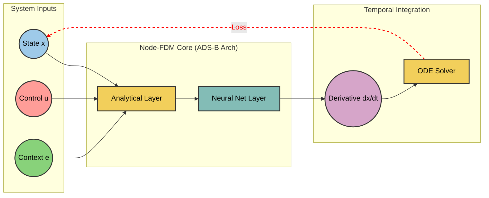

<p align="center">
  
</p>

<p align="center" style="font-size: 1.2em; color: #555;">
  A physics-guided <strong>Neural Ordinary Differential Equation (Neural ODE)</strong> framework for aircraft flight dynamics.
</p>

<p align="center">
  <a href="quickstart/installation/" class="md-button md-button--primary">Get Started</a>
  <a href="howto/train_model/" class="md-button">View Examples</a>
</p>

---

## 🎯 At a Glance

**node-fdm** bridges the gap between deep learning and aeronautics. It allows you to compose **hybrid dynamical models** by stacking physical principles, analytical features, and neural networks.

The diagram below illustrates the standard architecture used for **ADS-B data (OpenSky 2025)**, where an analytical layer pre-processes physical features before feeding them into a neural network:



### Key Capabilities

!!! quote ""
    * **Reconstruct Trajectories**: Generate coherent flight paths from ADS-B or QAR data.
    * **Physics-Aware**: Simulate behavior using latent dynamics constrained by aeronautical laws.
    * **Ready-to-Use**: Includes architectures for **OpenSky 2025** and **QAR**.
    * **Benchmark Ready**: Compare directly against physical models like **BADA**.

---

## 🚀 Workflow & Navigation

Follow the pipelines mirrored in the repository layout.

<div class="grid cards" markdown>

-   [:material-flag-checkered: **Quickstart**](quickstart/installation/)

    ---

    Get started with the essentials.

    * [Installation](quickstart/installation/)
    * [Core Concepts](quickstart/concepts/)
    * [Pipelines Overview](quickstart/pipeline/)

-   [:material-tools: **How to**](howto/configure_params/)

    ---

    Configure and customize your project.

    * [Configure Project](howto/configure_params/)
    * [Create Architecture](howto/create_architecture/)
    * [Train a Model](howto/train_model/)
    * [Run Inference](howto/run_inference/)


-   [:material-book-open-page-variant: **API Reference**](reference/node_fdm/)

    ---

    Technical documentation for developers.

    * [Overview](reference/node_fdm/)
    * [Architectures](reference/architectures/) 
    * [Trainer](reference/ode_trainer/) & [Predictor](reference/predictor/)
    * [Data](reference/data/) & [Models](reference/models/)

</div>

---

## ⚡ Quick Install

You can install the core package directly via pip:

```bash
pip install node-fdm
# Or for editable research mode:
pip install -e .[dev]
```

---

!!! danger "Legal Notice"
    **This project is intended for research purposes only.**
    
    This project is distributed under the **EUPL-1.2** license with specific EUROCONTROL amendments. It must **not** be used as a regulatory or operational tool under any circumstances. See `AMENDMENT_TO_EUPL_license.md` for details.