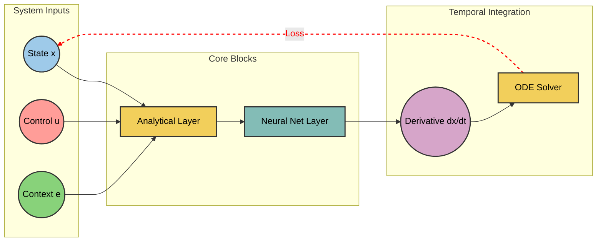

<p align="center">
  
</p>

<p align="center" style="font-size: 1.2em; color: #555;">
  A physics-guided <strong>Neural Ordinary Differential Equation (Neural ODE)</strong> framework for aircraft flight dynamics.
</p>

<p align="center">
  <a href="quickstart/installation/" class="md-button md-button--primary">Get Started</a>
  <a href="howto/train_model/" class="md-button">View Examples</a>
</p>

---

## 🎯 At a Glance

**node-fdm** bridges the gap between deep learning and aeronautics. It allows you to compose **hybrid dynamical models** by stacking physical principles, analytical features, and neural networks.

The diagram below illustrates the standard architecture used for **ADS-B data (OpenSky 2025)**, where an analytical layer pre-processes physical features before feeding them into a neural network:


```mermaid
graph LR
    subgraph Inputs ["System Inputs"]
        direction TB
        X((State x))
        U((Control u))
        E((Context e))
    end

    subgraph Core ["Core Blocks"]
        direction LR
        B1[Analytical Layer]
        B2[Neural Net Layer]
    end

    subgraph Solver ["Temporal Integration"]
        direction TB
        DX((Derivative dx/dt))
        ODE[ODE Solver]
    end

    %% Connexions
    X --> B1
    U --> B1
    E --> B1
    B1 --> B2
    B2 --> DX
    DX --> ODE
    ODE -.->|Loss| X

    %% Styles
    classDef cInput fill:#9ECAE9,stroke:#333,stroke-width:2px,color:black
    classDef cControl fill:#FF9D98,stroke:#333,stroke-width:2px,color:black
    classDef cContext fill:#88D27A,stroke:#333,stroke-width:2px,color:black
    classDef cAnalytics fill:#F2CF5B,stroke:#333,stroke-width:2px,color:black
    classDef cNeural fill:#83BCB6,stroke:#333,stroke-width:2px,color:black
    classDef cDerivative fill:#D6A5C9,stroke:#333,stroke-width:2px,color:black

    class X cInput
    class U cControl
    class E cContext
    class B1,ODE cAnalytics
    class B2 cNeural
    class DX cDerivative

    linkStyle 6 stroke:red,stroke-width:2px,stroke-dasharray: 5 5,color:red
```

### Key Capabilities

!!! quote ""
    * **Reconstruct Trajectories**: Generate coherent flight paths from ADS-B or QAR data.
    * **Physics-Aware**: Simulate behavior using latent dynamics constrained by aeronautical laws.
    * **Ready-to-Use**: Includes architectures for **OpenSky 2025** and **QAR**.
    * **Benchmark Ready**: Compare directly against physical models like **BADA**.

---

## 🚀 Workflow & Navigation

<div class="grid cards" markdown>

-   [:material-flag-checkered: **Quickstart**](quickstart/installation/)

    ---

    Get started with the essentials.

    * [Installation](quickstart/installation/)
    * [Core Concepts](quickstart/concepts/)
    * [Pipelines Overview](quickstart/pipelines/)

-   [:material-tools: **How to**](howto/configure_params/)

    ---

    Configure and customize your project.

    * [Configure Project](howto/configure_params/)
    * [Create Architecture](howto/create_architecture/)
    * [Train a Model](howto/train_model/)
    * [Run Inference](howto/run_inference/)
    * [Contribute](howto/contribute/)


-   [:material-book-open-page-variant: **API Reference**](reference/node_fdm/)

    ---

    Technical documentation for developers.

    * [Overview](reference/node_fdm/)
    * [Architectures](reference/architectures/)
    * [Trainer](reference/trainer/) & [Predictor](reference/predictor/)
    * [Data](reference/data/) & [Models](reference/models/)

</div>

---

## 📦 Packages

This project is organized as a **UV mono-workspace** with three packages:

| Package | Description |
|---|---|
| **[node-fdm-data](https://github.com/eurocontrol-asu/node-fdm-v2/tree/main/packages/node-fdm-data)** | Flight data processing, physics, unit conversions, column schemas — Polars-first |
| **[node-fdm](https://github.com/eurocontrol-asu/node-fdm-v2/tree/main/packages/node-fdm)** | Neural ODE models, layers, training, prediction — PyTorch + Pydantic |
| **[node-fdm-bada](https://github.com/eurocontrol-asu/node-fdm-v2/tree/main/packages/node-fdm-bada)** | BADA 4.2 aircraft performance baseline |

---

## 🎨 Use Cases & Publications

#### OpenSky Symposium 2025 (ADS-B)
*Jarry, G. & Olive, X. (2025). "Generation of Vertical Profiles with Neural Ordinary Differential Equations Trained on Open Trajectory Data," Journal of Open Aviation Science, Proceedings of the 13th OpenSky Symposium.*

<details>
<summary><strong>👇 Click to copy BibTeX</strong></summary>

```bibtex
@inproceedings{jarry2025profiles,
  author = {Jarry, Gabriel and Olive, Xavier},
  title = {Generation of Vertical Profiles with Neural Ordinary Differential Equations Trained on Open Trajectory Data},
  booktitle = {Proceedings of the 13th OpenSky Symposium},
  journal = {Journal of Open Aviation Science},
  year = {2025},
  note = {Under review}
}
```
</details>

#### SESAR Innovation Days 2025 (QAR)
*Jarry, G., Dalmau, R., Olive, X., & Very, P. (2025). "A Neural ODE Approach to Aircraft Flight Dynamics Modelling," arXiv:2509.23307.*

<details>
<summary><strong>👇 Click to copy BibTeX</strong></summary>

```bibtex
@misc{jarry2025neural,
  title={A Neural ODE Approach to Aircraft Flight Dynamics Modelling},
  author={Gabriel Jarry and Ramon Dalmau and Xavier Olive and Philippe Very},
  year={2025},
  eprint={2509.23307},
  archivePrefix={arXiv},
  primaryClass={cs.LG},
  note = {Proceedings of the SESAR Innovation Days 2025}
}
```
</details>

---

## ⚡ Quick Install

```bash
git clone https://github.com/eurocontrol-asu/node-fdm-v2.git
cd node-fdm-v2
uv sync
```

---

!!! danger "Legal Notice"
    **This project is intended for research purposes only.**

    This project is distributed under the **EUPL-1.2** license with specific EUROCONTROL amendments. It must **not** be used as a regulatory or operational tool under any circumstances.
