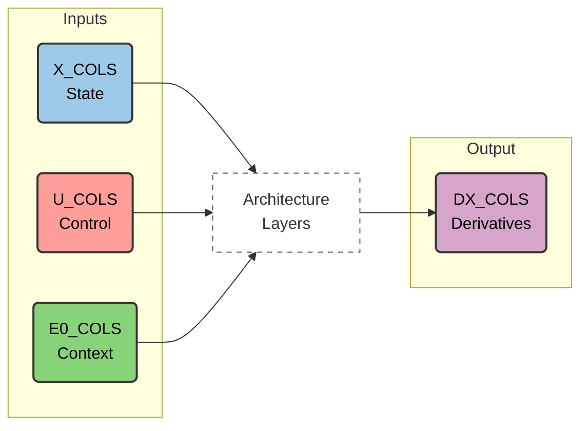
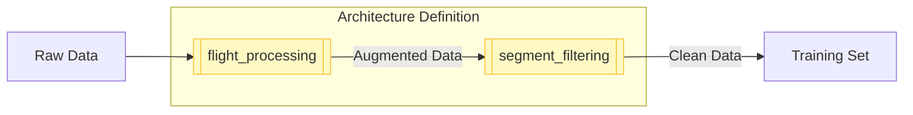
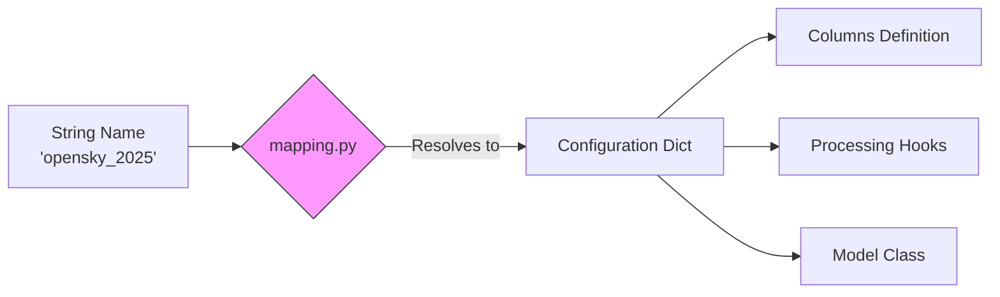

# 🧠 Core Concepts

This section introduces the fundamental building blocks of **node-fdm**. Understanding these concepts will help you navigate architectures, preprocess data, and extend the framework with your own models.

---

## 🔢 Column Groups

Every architecture organizes its input and output features into standardized **column groups**. These groups define the **information flow** inside the Neural ODE.



| Group | Variable Type | Description |
| :--- | :--- | :--- |
| **`X_COLS`** | **State** | Flight variables integrated by the ODE (e.g., altitude, speed). |
| **`U_COLS`** | **Control** | Pilot inputs, FMS selections, or active controls. |
| **`E0_COLS`** | **Environmental** | Exogenous inputs like wind, temperature, or static distances. |
| **`E_COLS`** | **Derived** | Intermediate features calculated by physics layers (e.g., Mach number). |
| **`DX_COLS`** | **Derivatives** | The target outputs predicted by the ODE layer (e.g., `dalt`, `dvz`). |

---

## 🏗️ Architecture Stack

An architecture in **node-fdm** is not just a neural network; it is a **stack** of components defined in `model.py`.

!!! quote "The Stack"
    **Architecture = Physics Layers + Neural Layers**

1.  **Physics/Feature Layers**: Deterministic layers that compute derived quantities (e.g., `TrajectoryLayer`, `EngineLayer`).
2.  **Structured Layers**: The Neural ODE components (`StructuredLayer`) that predict the final derivatives (`DX_COLS`).

The `model.py` file defines the explicit order of these layers and how column groups are mapped between them.

---

## 🔧 Processing Hooks

Architectures are **self-contained**: they define not only the model but also how the data must be prepared. This is handled via two specific hooks:



* **`flight_processing`**: Augments raw data before training (e.g., computing `alt_diff`, smoothing signals, adding derived physics).
* **`segment_filtering`**: Removes poor-quality segments or invalid training examples based on domain-specific rules.

---

## 📐 Normalization & Statistics

The `SeqDataset` class handles data normalization automatically to ensure **consistent training and inference**.

!!! check "Automated Features"
    * **Statistics**: Computes mean and standard deviation for every column.
    * **Robust Scaling**: Applies outlier-robust scaling (clipped at 99.5%).
    * **Metadata**: Saves all statistics to `meta.json`, ensuring the inference pipeline uses the exact same scaling as the training pipeline.

---
## 🧩 Registration Mechanism

For the `ODETrainer` or `NodeFDMPredictor` to utilize your custom architecture, it must be discoverable via the central registry.

!!! info "Registry Location"
    The mapping is defined in: `node_fdm/architectures/mapping.py`

This file resolves a simple **string identifier** (e.g., `"opensky_2025"`) into a configuration dictionary that links the three essential components of your architecture:



### Registration Example

Inside `mapping.py`, the registration looks like this:

```python title="node_fdm/architectures/mapping.py"
AVAILABLE_ARCHITECTURES = {
    "opensky_2025": {
        "columns": OpenSkyColumns,     # (1)
        "hooks": {                     # (2)
            "flight": process_flight,
            "segment": filter_segment
        },
        "model_class": OpenSkyModel    # (3)
    },
    # Your custom architecture here...
}
```

1.  **Column Definitions**: Defines `X_COLS`, `U_COLS`, etc.
2.  **Processing Hooks**: The functions used to preprocess raw data.
3.  **Layer Stack**: The Python class defining the Neural ODE layers.

---

## 🚀 Next Steps

* **[Pipelines Overview](../pipelines/)**: Now that you understand the core building blocks, see how they fit together in a complete workflow.
