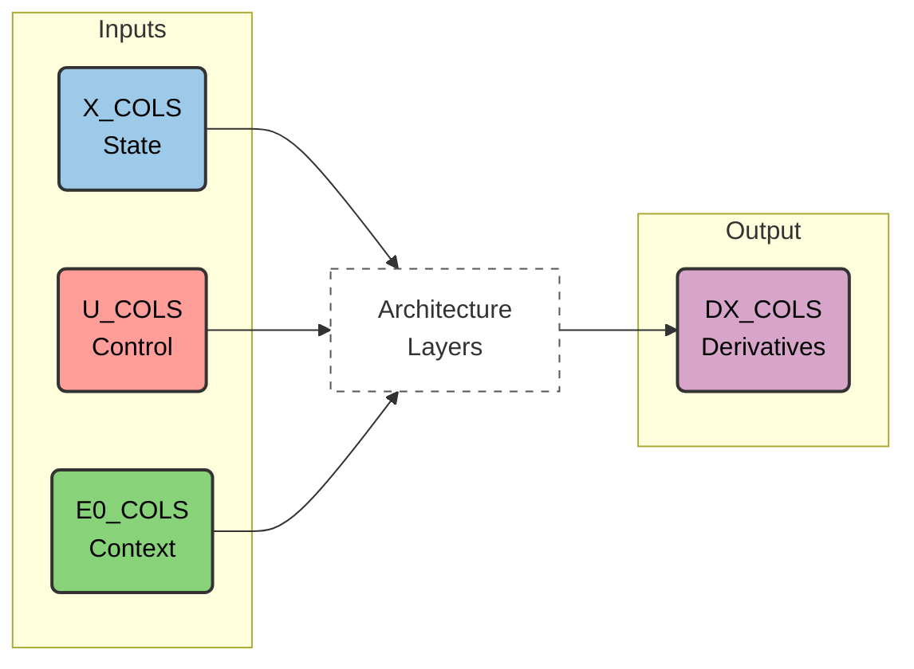
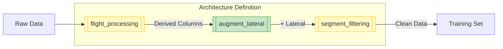
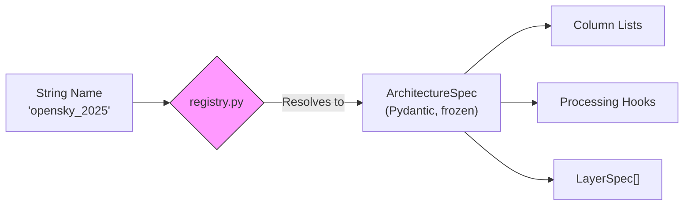

# 🧠 Core Concepts

This section introduces the fundamental building blocks of **node-fdm**. Understanding these concepts will help you navigate architectures, preprocess data, and extend the framework with your own models.

---

## 🔢 Column Groups

Every architecture organizes its input and output features into standardized **column groups**. These groups define the **information flow** inside the Neural ODE.


```mermaid
graph LR
    subgraph Inputs
        direction TB
        X(X_COLS<br>State)
        U(U_COLS<br>Control)
        E0(E0_COLS<br>Context)
    end

    subgraph Output
        DX(DX_COLS<br>Derivatives)
    end

    Model[Architecture<br>Layers]

    X & U & E0 --> Model --> DX

    classDef state fill:#9ECAE9,stroke:#333,stroke-width:2px,color:black;
    classDef control fill:#FF9D98,stroke:#333,stroke-width:2px,color:black;
    classDef context fill:#88D27A,stroke:#333,stroke-width:2px,color:black;
    classDef derivative fill:#D6A5C9,stroke:#333,stroke-width:2px,color:black;
    classDef model fill:#fff,stroke:#555,stroke-width:1px,stroke-dasharray: 5 5;

    class X state;
    class U control;
    class E0 context;
    class DX derivative;
    class Model model;
```

| Group | Variable Type | Description |
| :--- | :--- | :--- |
| **`X_COLS`** | **State** | Flight variables integrated by the ODE (e.g., altitude, speed) |
| **`U_COLS`** | **Control** | Pilot inputs, FMS selections, or active controls |
| **`E0_COLS`** | **Environmental** | Exogenous inputs like wind, temperature, or static distances |
| **`E1_COLS`** | **Derived** | Intermediate features calculated by physics layers (e.g., Mach number) |
| **`DX_COLS`** | **Derivatives** | Target outputs predicted by the ODE layer (e.g., `dalt`, `dvz`) |

Column groups are defined as plain Python lists in `node_fdm_data.schemas`:

```python
from node_fdm_data.schemas.opensky import X_COLS, U_COLS, E0_COLS, DX_COLS

print(X_COLS)   # ['distance_m', 'altitude_ft', 'gamma_rad', 'tas_kt']
print(U_COLS)   # ['alt_sel_ft', 'mach_sel', 'cas_sel_kt', 'vz_sel_ftmin']
```

---

## 🏗️ Architecture Stack

An architecture in **node-fdm** is a **typed specification** defined with Pydantic models:

!!! quote "The Stack"
    **Architecture = `ArchitectureSpec` + `LayerSpec[]`**

1.  **Physics/Feature Layers**: Deterministic layers that compute derived quantities (e.g., `TrajectoryLayer`, `EngineLayer`).
2.  **Structured Layers**: The Neural ODE components (`StructuredLayer`) that predict the final derivatives (`DX_COLS`).

```python
from node_fdm.architectures.registry import get

spec = get("opensky_2025")
for layer in spec.layers:
    print(f"{layer.name}: {layer.layer_class} (trainable={layer.trainable})")
```

---

## 🔧 Processing Hooks

Architectures are **self-contained**: they define not only the model but also how the data must be prepared. This is handled via two processing hooks:


```mermaid
graph LR
    Raw[Raw Data] --> Hook1

    subgraph Architecture Definition
        direction TB
        Hook1[[flight_processing]]
        Hook3[[augment_lateral]]
        Hook2[[segment_filtering]]
    end

    Hook1 -->|Derived Columns| Hook3
    Hook3 -->|+ Lateral| Hook2
    Hook2 -->|Clean Data| Train[Training Set]

    style Hook1 fill:#FFF9C4,stroke:#FBC02D
    style Hook2 fill:#FFF9C4,stroke:#FBC02D
    style Hook3 fill:#C8E6C9,stroke:#43A047
```

* **`flight_processing`**: Augments raw data before training (e.g., computing `alt_diff`, `gamma_air`, smoothing signals).
* **`augment_lateral`**: Adds lateral dynamics columns — turn detection, orthodromic/rhumb bearings, drift angle, and lateral wind component.
* **`segment_filtering`**: Removes poor-quality segments based on domain-specific rules.

These hooks are referenced in the `ArchitectureSpec` as dotted paths and resolved at runtime.

---

## 📐 Normalization & Statistics

The `FlightDataset` class handles data normalization automatically:

!!! check "Automated Features"
    * **Statistics**: Computes mean and standard deviation for every column via `compute_stats`. Supports optional `e1_cols` for extra environment columns.
    * **Robust Scaling**: Applies outlier-robust scaling (clipped at max ratio).
    * **Metadata**: Saves all statistics to `meta.json`, ensuring inference uses the exact same scaling as training.

---

## 🧩 Registration Mechanism

Architectures are registered via a **typed Pydantic registry** instead of the legacy `mapping.py` dictionary:


```mermaid
graph LR
    ID["String Name<br>'opensky_2025'"] --> Reg{registry.py}

    Reg -->|Resolves to| Spec["ArchitectureSpec<br>(Pydantic, frozen)"]

    Spec --> Cols[Column Lists]
    Spec --> Hook[Processing Hooks]
    Spec --> Layers["LayerSpec[]"]

    style Reg fill:#f9f,stroke:#333
```

```python
from node_fdm.architectures.registry import register, get, ArchitectureSpec

# Architectures auto-register on import
spec = get("opensky_2025")

# Or register a custom one
register(ArchitectureSpec(name="my_arch", ...))
```

---

## 🚀 Next Steps

* **[Pipelines Overview](../pipelines/)**: See how these concepts fit together in a complete workflow.
