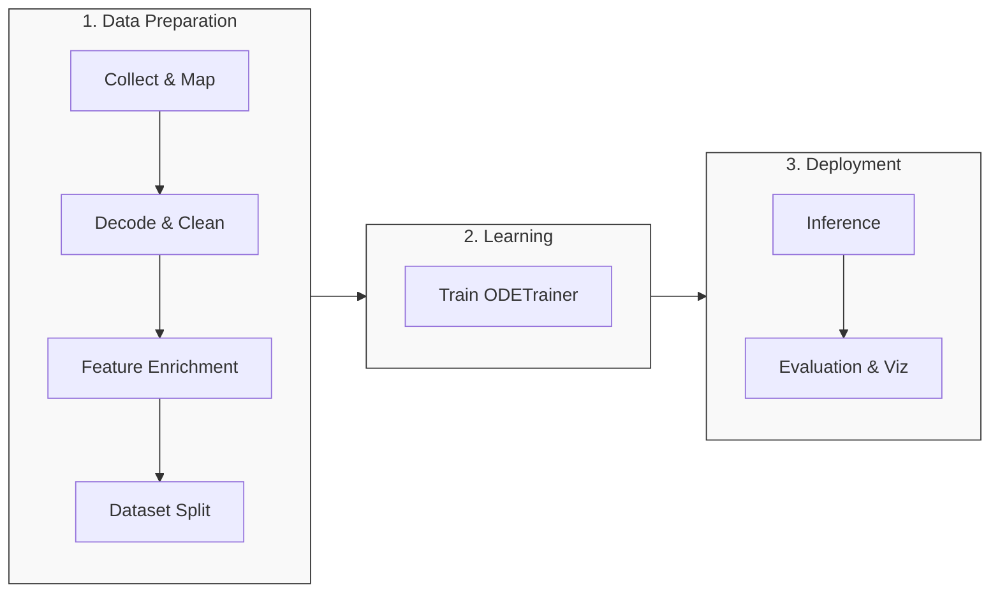

# ⚡ Quickstart: End-to-End Pipelines

This guide provides a complete overview of how to run **node-fdm** end-to-end. It covers the abstract workflow used by all architectures and provides a step-by-step walkthrough of the **OpenSky 2025** reference implementation.

!!! info "Configuration"
    All paths assume you are at the repository root. Each pipeline ships its own configuration file:
    
    * `scripts/opensky/config.yaml`
    * `scripts/qar/config.yaml`

---

## 🔄 General Pattern

Regardless of the data source (ADS-B or QAR), every architecture follows this 7-step logic.



1.  **Collect and prepare raw data**: Ensure inputs map to the architecture’s `Column` definitions.
2.  **Decode, resample, and clean**: Build consistent time steps and remove invalid segments.
3.  **Feature enrichment**: Add environmental inputs (e.g., ERA5) and compute derived physics quantities.
4.  **Dataset splitting**: Generate train/val/test lists pointing to processed parquet files.
5.  **Training**: Run `ODETrainer`, loading the specific `model_params` from `model.py`.
6.  **Inference**: Load checkpoints with `NodeFDMPredictor` to generate trajectory rollouts.
7.  **Evaluation**: Compute metrics (MAE/MAPE) and generate comparison plots.

---

## 📡 OpenSky 2025 (ADS-B) Pipeline

This reference pipeline processes public ADS-B data. The scripts are located in `scripts/opensky/`.

=== "Phase 1: Data Preparation"

    These steps fetch raw data and transform it into enriched, training-ready tensors.

    **1. Aircraft Sampling**
    Builds the database of target aircraft types.
    ```bash
    python scripts/opensky/01_aircraft_list.py
    ```
    * *Input*: Trino SQL connection.
    * *Output*: `data/aircraft_db.csv`.

    **2. Download Raw Data**
    Fetches flight history and extended tables.
    ```bash
    python scripts/opensky/02_download_data.py
    ```
    * *Output*: `data/downloaded_parquet/`.

    **3. Decode & Resample**
    Decodes specific BDS messages, filters short flights, and resamples to 4s.
    ```bash
    python scripts/opensky/03_preprocess_data.py
    ```
    * *Note*: Handles ADEP/ADES distance computation.

    **4. Enrichment**
    Injects ERA5 weather data and smooths signals.
    ```bash
    python scripts/opensky/04_weather_spd_process_data.py
    ```
    * *Output*: Enriched files in `data/processed_flights/<TYPECODE>/`.

=== "Phase 2: Training"

    Train the Neural ODE using the architecture defined in `node_fdm.architectures.opensky_2025`.

    **5. Train Model**
    ```bash
    python scripts/opensky/05_training.py
    ```
    * *Action*: Uses `ODETrainer`.
    * *Output*: Checkpoints saved to `models/opensky_<TYPECODE>/`.

=== "Phase 3: Inference & Eval"

    Generate predictions and benchmark against BADA.

    **6. Inference (Rollouts)**
    ```bash
    python scripts/opensky/06_flight_prediction.py
    ```
    * *Output*: `data/predicted_flights/<TYPECODE>/`.

    **7. Baselines & Metrics**
    Run these scripts in order to assess performance:

    * `07_bada_prediction.py`: Computes physical baseline (Requires BADA 4.2 files).
    * `08_visualize_predictions.py`: Generates overlays (Ground Truth vs Model vs BADA).
    * `09_performance_aggregation.py`: Computes MAE/MAPE metrics per flight phase.
    * `10_dataset_stats.py`: Generates coverage statistics.

---

## 💡 General Tips

!!! tip "Single Source of Truth"
    Always use the pipeline's `config.yaml` to define paths, typecodes, and shared parameters. Do not hardcode paths in scripts.

!!! warning "Caching"
    Ensure `data/era5_cache` exists. Meteorological data download is slow; caching prevents repeated downloads of the same ERA5 fields.

!!! check "Hardware Optimization"
    If you face memory issues, adjust the following in `model_config`:
    
    * Decrease `batch_size`.
    * Decrease `num_workers`.
    * Adjust `seq_len` (sequence length).

---

## 🚀 Next Steps

Now that you understand the core building blocks, start applying them by following the step-by-step development workflow:

* **[1. Configure Project](../../howto/configure_params/)**: Set up paths, typecodes, and key hyperparameters for your pipeline.
* **[2. Create an Architecture](../../howto/create_architecture/)**: Define your custom model's column groups, preprocessing hooks, and layer stack.
* **[3. Train a Model](../../howto/train_model/)**: Launch the learning process using the `ODETrainer`.
* **[4. Run Inference](../../howto/run_inference/)**: Generate trajectory rollouts and evaluate the model's performance.