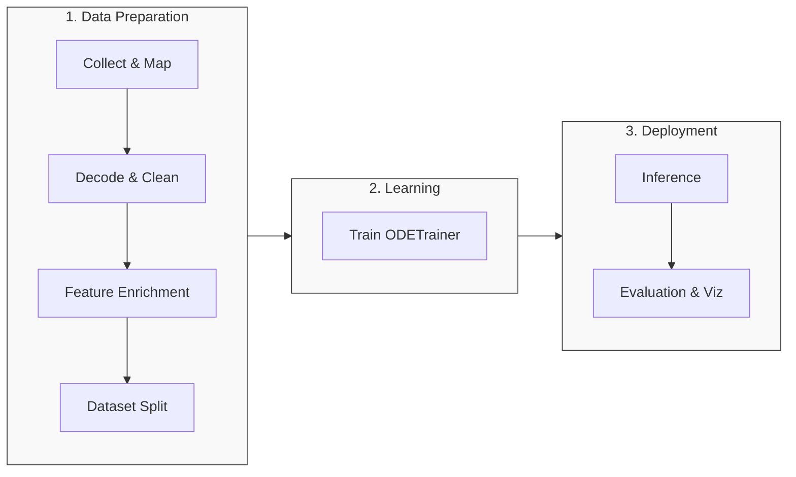

# ⚡ Quickstart: End-to-End Pipelines

This guide provides a complete overview of how to run **node-fdm** end-to-end. It covers the abstract workflow used by all architectures and provides a step-by-step walkthrough of the **OpenSky 2025** reference implementation.

!!! info "Configuration"
    All paths assume you are at the repository root. Each pipeline ships its own configuration file:

    * `scripts/opensky/config.yaml`
    * `scripts/qar/config.yaml`

---

## 🔄 General Pattern

Regardless of the data source (ADS-B or QAR), every architecture follows this 7-step logic.


```mermaid
graph LR
    subgraph Prep [1. Data Preparation]
        direction TB
        S1[Collect & Map] --> S2[Decode & Clean]
        S2 --> S3[Feature Enrichment]
        S3 --> S4[Dataset Split]
    end

    subgraph Learn [2. Learning]
        direction TB
        S5[Train ODETrainer]
    end

    subgraph Eval [3. Deployment]
        direction TB
        S6[Inference] --> S7[Evaluation & Viz]
    end

    Prep --> Learn --> Eval

    classDef phase fill:#f9f9f9,stroke:#333,stroke-width:1px;
    class Prep,Learn,Eval phase;
```

1.  **Collect and prepare raw data**: Ensure inputs map to the architecture's column schemas.
2.  **Decode, resample, and clean**: Build consistent time steps and remove invalid segments.
3.  **Feature enrichment**: Add environmental inputs (e.g., ERA5) and compute derived physics.
4.  **Dataset splitting**: Generate train/val/test split via `split_by_icao`.
5.  **Training**: Run `ODETrainer` with a `TrainingConfig`.
6.  **Inference**: Load checkpoints with `NodeFDMPredictor` to generate trajectory rollouts.
7.  **Evaluation**: Compute metrics (MAE/MAPE) and generate comparison plots.

---

## 📡 OpenSky 2025 (ADS-B) Pipeline

This reference pipeline processes public ADS-B data. The scripts are located in `scripts/opensky/`.

=== "Phase 1: Data Preparation"

    **1. Aircraft Sampling**
    ```bash
    python scripts/opensky/01_aircraft_list.py
    ```
    * *Input*: Trino SQL connection
    * *Output*: `data/aircraft_db.csv`

    **2. Download Raw Data**
    ```bash
    python scripts/opensky/02_download_data.py
    ```
    * *Output*: `data/downloaded_parquet/`

    **3. Decode & Resample**
    ```bash
    python scripts/opensky/03_preprocess_data.py
    ```
    * *Note*: Handles ADEP/ADES distance computation

    **4. Enrichment**
    ```bash
    python scripts/opensky/04_weather_spd_process_data.py
    ```
    * *Output*: Enriched files in `data/processed_flights/<TYPECODE>/`

=== "Phase 2: Training"

    **5. Train Model**
    ```bash
    python scripts/opensky/05_training.py
    ```
    * *Uses*: `ODETrainer` with `TrainingConfig` (Pydantic)
    * *Output*: Checkpoints in `models/opensky_<TYPECODE>/`

=== "Phase 3: Inference & Eval"

    **6. Inference (Rollouts)**
    ```bash
    python scripts/opensky/06_flight_prediction.py
    ```
    * *Output*: `data/predicted_flights/<TYPECODE>/`

    **7. Baselines & Metrics**

    * `07_bada_prediction.py`: BADA 4.2 physical baseline (requires BADA files)
    * `08_visualize_predictions.py`: Overlay plots (Ground Truth vs Model vs BADA)
    * `09_performance_aggregation.py`: MAE/MAPE metrics per flight phase
    * `10_dataset_stats.py`: Coverage statistics

---

## 💡 General Tips

!!! tip "Single Source of Truth"
    Always use the pipeline's `config.yaml` to define paths, typecodes, and shared parameters.

!!! warning "Caching"
    Ensure `data/era5_cache` exists. Meteorological data download is slow; caching prevents repeated downloads.

!!! check "Hardware Optimization"
    If you face memory issues, adjust in `TrainingConfig`:

    * Decrease `batch_size`
    * Adjust `seq_len` (sequence length)

---

## 🚀 Next Steps

* **[Configure Project](../../howto/configure_params/)**: Set up paths and key hyperparameters
* **[Create an Architecture](../../howto/create_architecture/)**: Define your custom model
* **[Train a Model](../../howto/train_model/)**: Launch the learning process
* **[Run Inference](../../howto/run_inference/)**: Generate trajectory rollouts
