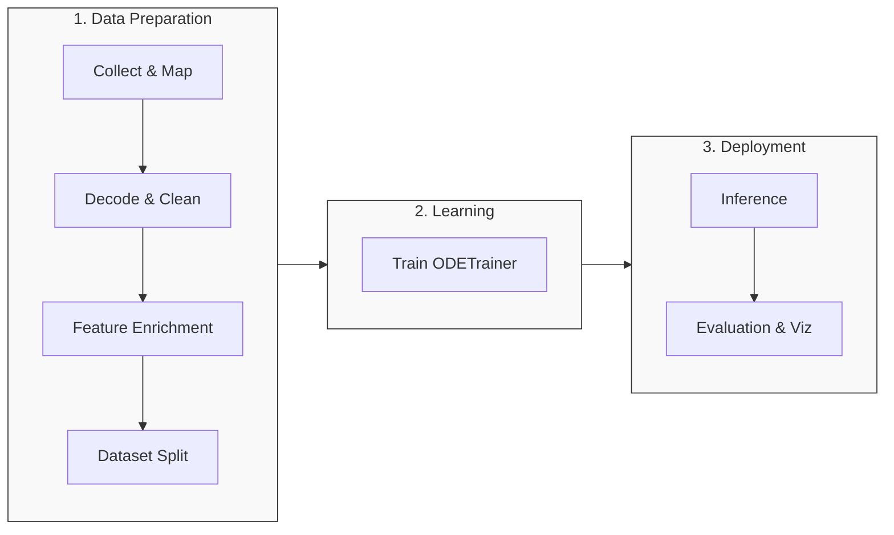

# ⚡ Quickstart: End-to-End Pipelines

This guide provides a complete overview of how to run **node-fdm** end-to-end. It covers the abstract workflow used by all architectures and provides a step-by-step walkthrough of the **OpenSky 2025** reference implementation.

!!! info "Configuration"
    All commands assume you are at the repository root and have a `config.yaml` defining paths and parameters. See **[Configure Project](../../howto/configure_params/)** for details.

---

## 🔄 General Pattern

Regardless of the data source (ADS-B or QAR), every architecture follows this 7-step logic.


```mermaid
graph LR
    subgraph Prep [1. Data Preparation]
        direction TB
        S1[Collect & Map] --> S2[Decode & Clean]
        S2 --> S3[Feature Enrichment]
        S3 --> S4[Dataset Split]
    end

    subgraph Learn [2. Learning]
        direction TB
        S5[Train ODETrainer]
    end

    subgraph Eval [3. Deployment]
        direction TB
        S6[Inference] --> S7[Evaluation & Viz]
    end

    Prep --> Learn --> Eval

    classDef phase fill:#f9f9f9,stroke:#333,stroke-width:1px;
    class Prep,Learn,Eval phase;
```

1.  **Collect and prepare raw data**: Ensure inputs map to the architecture's column schemas.
2.  **Decode, resample, and clean**: Build consistent time steps and remove invalid segments.
3.  **Feature enrichment**: Add environmental inputs (e.g., ERA5) and compute derived physics.
4.  **Dataset splitting**: Generate train/val/test split via `split_by_icao`.
5.  **Training**: Run `ODETrainer` with a `TrainingConfig`.
6.  **Inference**: Load checkpoints with `NodeFDMPredictor` to generate trajectory rollouts.
7.  **Evaluation**: Compute metrics (MAE/MAPE) and generate comparison plots.

---

## 📡 OpenSky 2025 (ADS-B) Pipeline

This reference pipeline processes public ADS-B data using the `fdm` CLI.

=== "Phase 1: Data Preparation"

    **1. Aircraft Sampling**
    ```bash
    fdm aircraft-list --config config.yaml
    ```
    * *Input*: Trino SQL connection
    * *Output*: `data/aircraft_db.csv`

    **2. Download Raw Data**
    ```bash
    fdm download --config config.yaml
    ```
    * *Output*: Delta Table at `data/flights.delta` (partitioned by `typecode` and `date`)

    **3. Decode & Resample**
    ```bash
    fdm preprocess --config config.yaml
    ```
    * *Note*: Handles ADEP/ADES distance computation

    **4. Process & Augment**
    ```bash
    fdm process --arch opensky --config config.yaml
    ```
    * ERA5 weather interpolation (TAS, Mach, CAS recomputation)
    * Per-flight: derived columns (`gamma_air`, `long_wind`), segment estimation (`mach_sel`, `cas_sel`, `vz_sel`)
    * Lateral augmentation: `in_turn`, `track_ortho`, `track_loxo`, `drift_angle`, `lat_wind`
    * Distance-jump cropping and train/val/test split
    * *Output*: Processed parquet files in `data/process/`

=== "Phase 2: Training"

    **5. Train Model**
    ```bash
    fdm train --config config.yaml
    ```
    * *Uses*: `ODETrainer` with `TrainingConfig` (Pydantic)
    * *Output*: Checkpoints in `models/opensky_<TYPECODE>/`

=== "Phase 3: Inference & Eval"

    **6. Inference (Rollouts)**
    ```bash
    fdm predict --config config.yaml
    ```
    * *Output*: `data/predicted_flights/<TYPECODE>/`

    **7. Baselines & Metrics**

    * `fdm predict-bada --config config.yaml`: BADA 4.2 physical baseline (requires BADA files)
    * `fdm visualize --config config.yaml`: Overlay plots (Ground Truth vs Model vs BADA)
    * `fdm evaluate --config config.yaml`: MAE/MAPE metrics per flight phase
    * `fdm dataset-stats --config config.yaml`: Coverage statistics

---

## 💡 General Tips

!!! tip "Single Source of Truth"
    Always use `config.yaml` to define paths, typecodes, and shared parameters.

!!! warning "Caching"
    Ensure `data/era5_cache` exists. Meteorological data download is slow; caching prevents repeated downloads.

!!! check "Hardware Optimization"
    If you face memory issues, adjust in `TrainingConfig`:

    * Decrease `batch_size`
    * Adjust `seq_len` (sequence length)

---

## 🚀 Next Steps

* **[Configure Project](../../howto/configure_params/)**: Set up paths and key hyperparameters
* **[Create an Architecture](../../howto/create_architecture/)**: Define your custom model
* **[Train a Model](../../howto/train_model/)**: Launch the learning process
* **[Run Inference](../../howto/run_inference/)**: Generate trajectory rollouts
