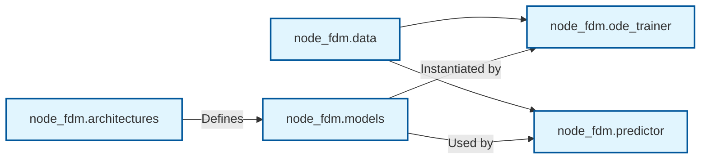

# 📚 API Overview

The **node_fdm** package is designed with modularity in mind. It separates data handling, physical/neural architectures, and the training/inference engines into distinct namespaces.

---

## 🗺️ Module Map

Here is a high-level view of how the sub-packages interact to form a complete pipeline:

---

## 📦 Core Namespaces

| Module | Description | Key Classes |
| :--- | :--- | :--- |
| **[`node_fdm.ode_trainer`](ode_trainer.md)** | **The Training Engine.** Handles the training loop, validation, and PyTorch Lightning integration. | `ODETrainer` |
| **[`node_fdm.predictor`](predictor.md)** | **The Inference Engine.** Wraps trained models to perform trajectory rollouts and simulations. | `NodeFDMPredictor` |
| **[`node_fdm.data`](data.md)** | **Data Pipeline.** Tools for dataset construction, loading, and batching. | `SeqDataset`, `FlightProcessor` |
| **[`node_fdm.architectures`](architectures.md)** | **The Registry.** Contains the built-in definitions (`opensky_2025`, `qar`) and the mapping logic. | `mapping.py`, `columns.py` |
| **[`node_fdm.models`](models.md)** | **Model Wrappers.** The underlying PyTorch modules and ODE integration utilities. | `StructuredLayer`, `PhysicsLayer` |
