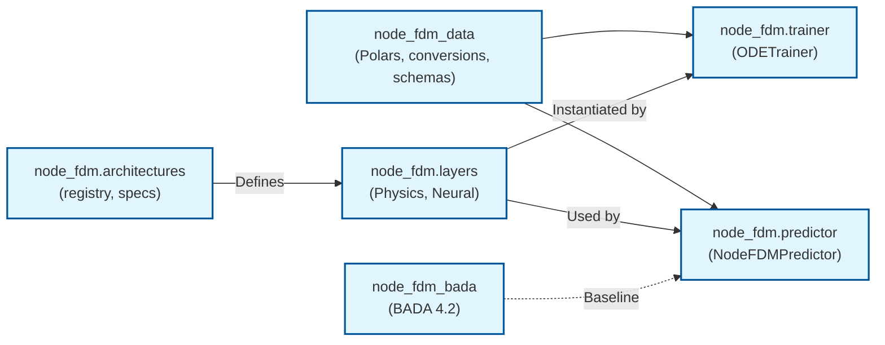

# 📚 API Overview

The **node-fdm** workspace is designed with modularity in mind. It separates data handling, physical/neural architectures, and the training/inference engines across three packages.

---

## 🗺️ Module Map

```mermaid
graph LR
    %% Data Flow
    Data["node_fdm_data<br>(Polars, conversions, schemas)"] --> Trainer
    Data --> Predictor

    %% Logic Flow
    Arch["node_fdm.architectures<br>(registry, specs)"] -->|Defines| Model["node_fdm.layers<br>(Physics, Neural)"]

    %% Execution Flow
    Model -->|Instantiated by| Trainer["node_fdm.trainer<br>(ODETrainer)"]
    Model -->|Used by| Predictor["node_fdm.predictor<br>(NodeFDMPredictor)"]

    %% BADA
    BADA["node_fdm_bada<br>(BADA 4.2)"] -.->|Baseline| Predictor

    %% Styling
    classDef package fill:#e1f5fe,stroke:#01579b,stroke-width:2px;
    class Data,Arch,Model,Trainer,Predictor,BADA package;
```

---

## 📦 Package Reference

| Package | Modules | Description |
| :--- | :--- | :--- |
| **[node-fdm-data](data.md)** | `conversions`, `isa`, `schemas`, `split`, `processor` | Flight data layer — Polars-first processing, unit conversions, ISA model |
| **[node-fdm](architectures.md)** | `architectures`, `layers`, `trainer`, `predictor`, `dataset` | Neural ODE core — models, training, inference |
| **[node-fdm-bada](models.md)** | `airspeed`, `mapping` | BADA 4.2 physical baseline |
