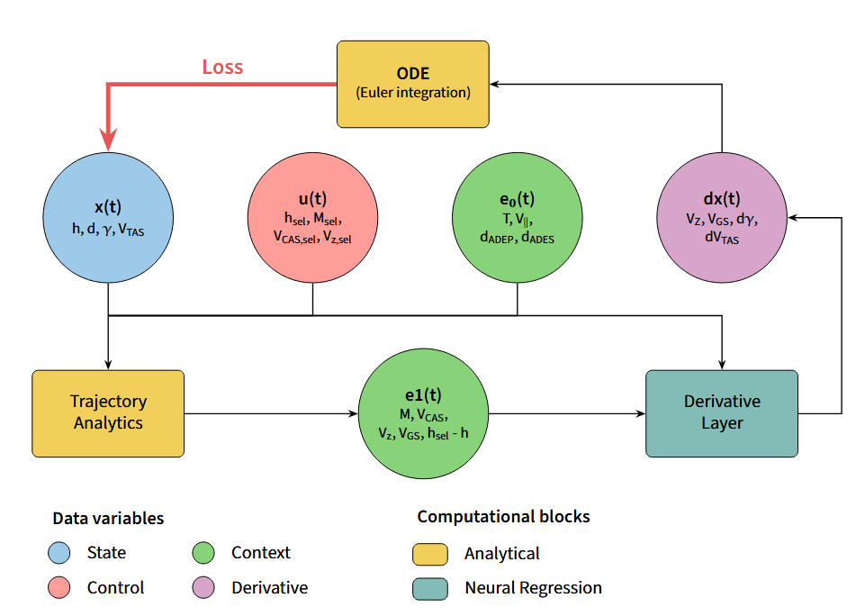

# Summary

Aircraft trajectory prediction is a cornerstone of modern Air Traffic Management (ATM), enabling applications ranging from collision avoidance to fuel efficiency monitoring. However, accurate flight dynamics modeling typically requires proprietary manufacturer performance data or complex kinetic models.

`node-fdm` is a Python library designed to bridge the gap between data-driven deep learning and classical aeronautical physics. It utilizes Neural Ordinary Differential Equations (Neural ODEs) [@chen2018neural] to learn aircraft dynamics from observational data. By coupling physical laws (equations of motion) with neural networks, `node-fdm` allows researchers to reconstruct coherent flight profiles, infer missing aerodynamic parameters, and simulate counterfactual trajectories. The library supports end-to-end pipelines for both public Automatic Dependent Surveillance–Broadcast (ADS-B) data and proprietary Quick Access Recorder (QAR) streams.

# Statement of need

In the domain of ATM research, trajectory modeling often faces a dichotomy. On one side, kinetic models like BADA (Base of Aircraft Data) [@nuic2010bada] or OpenAP [@sun2020openap] rely on explicit coefficients and assumptions that may not capture the idiosyncrasies of specific airframes or weather conditions. On the other side, pure deep learning approaches (e.g., LSTMs) often violate physical constraints, leading to unrealistic energy states or vertical profiles.

`node-fdm` addresses these limitations by providing a reproducible, open-source framework for **physics-guided** learning. It fills a specific niche for researchers who need:

1.  **Data Versatility:** The ability to ingest noisy, sparse public data (ADS-B) where key parameters like mass and thrust are missing, as well as high-fidelity private data (QAR).
2.  **Physical Consistency:** Unlike standard regression models, `node-fdm` solves the initial value problem using ODE solvers, ensuring that the generated trajectories are continuous and physically plausible (e.g., preserving energy balance).
3.  **Reproducibility:** A major hurdle in ATM research is the lack of standardized training pipelines. `node-fdm` provides complete workflows, from data download and smoothing to training and evaluation, allowing the community to benchmark new architectures against established baselines.

While general-purpose Neural ODE libraries exists (e.g., `torchdiffeq`), applying them to aviation requires significant boilerplate code for unit conversion, aerodynamic feature engineering, and coordinate transformations. `node-fdm` abstracts these complexities, offering a domain-specific toolkit for aviation data science.

# Library design and implementation

The package is implemented in PyTorch [@paszke2019pytorch] and is organized around four core abstractions designed for modularity and extensibility:

### 1. Column Schema and Units
To handle the heterogeneity of aviation data formats, `node-fdm` introduces a `Column` object. This enforces SI units, defines derivative relationships (e.g., altitude vs. vertical speed), and maps raw input names to standardized internal representations. This schema drives the `FlightProcessor`, which handles time-resampling, smoothing, and feature injection automatically.

### 2. Sequence Datasets
The `SeqDataset` class manages the creation of sliding windows necessary for training ODEs. It handles:
- Efficient, parallel loading of Parquet files.
- Automated segment filtering to remove physically impossible data points (e.g., teleportation artifacts in raw ADS-B).
- Calculation of global statistics for unit-aware normalization, crucial for the convergence of gradient-based solvers.

### 3. Modular Architectures
Architectures in `node-fdm` are not monolithic. They are defined as ordered stacks of layers in the `architectures.mapping` registry. A typical stack includes:
- **Physics Layers:** Deterministic modules that compute derived quantities (e.g., Mach number, True Airspeed, Air density from ERA5 weather data).
- **Structured Layers:** Learnable modules where the Neural ODE lives. These layers predict the derivatives ($\frac{dx}{dt}$) of the state vector based on the current state and control inputs.

The library ships with two reference architectures:
- `opensky_2025`: Optimized for public data, reconstructing vertical profiles using weather data to compensate for missing onboard sensors and illustration of the architecture is displayed in \autoref{fig:architecture}.
- `qar`: A high-fidelity architecture that leverages inputs such as flap settings, landing gear status, and fuel flow.

### 4. The Training Engine
The `ODETrainer` orchestrates the learning process. It integrates with `torchdiffeq` to perform the forward pass (integration) and backpropagation. It supports per-layer checkpointing, allowing researchers to freeze physical components while fine-tuning neural components, or to perform ablation studies easily.

# Use cases

`node-fdm` has enabled recent scholarly work in flight dynamics:

- **On Opensky ADS-B Data:** @jarry2025profiles demonstrated the library's ability to generate accurate vertical profiles using only open ADS-B data enriched with ERA5 weather reanalysis. The library provides the exact pipeline used to download, preprocess, and train the models presented in this study.
- **On Quick Access Recorder (QAR) Data:** @jarry2025neural used the `qar` pipeline on operational data to benchmark Neural ODEs against traditional operational baselines showing enhanced performance.

# Mathematics

The core mathematical principle relied upon by `node-fdm` is the parameterization of the time derivative of the aircraft state $x(t)$ by a neural network $f_\theta$:

$$\frac{dx(t)}{dt} = f_\theta(x(t), u(t), e(t))$$

Where $u(t)$ represents control inputs and $u(t)$  the environmental context. The state at time $t_1$ is obtained via integration:

$$x(t_1) = x(t_0) + \int_{t_0}^{t_1} f_\theta(x(t), u(t), e(t)) dt$$

`node-fdm` solves this integral using various numerical solvers (e.g., Runge-Kutta 4, Euler) provided by the ecosystem, ensuring that the learned dynamics respect the temporal continuity of flight.

# Acknowledgements

This work was developed within EUROCONTROL’s Aviation Sustainability Unit, with contributions from ONERA (The French Aerospace Lab). We acknowledge the OpenSky Network community for maintaining the open ADS-B data lake [@schaefer2014opensky] that makes the open-source component of this research possible.

# References