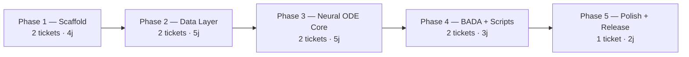
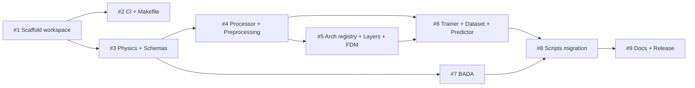

# 🗺️ Implementation Plan — node-fdm-v2

**30 modules · 5 phases · 9 tickets · ~3 weeks**

---

## Phase 1 — Scaffold (2 tickets)

> **Goal**: UV workspace fonctionnel, 3 packages importables, CI green

| # | Ticket | Type | Priority | Scope | Pts |
|---|---|---|---|---|---|
| 1 | **infra(workspace): scaffold UV mono-workspace with 3 packages** | infrastructure | critical | Workspace root, `node-fdm-data`, `node-fdm`, `node-fdm-bada` | 3 |
| | `axm-init scaffold` pour la structure de base, puis adapter : `pyproject.toml` racine avec `[tool.uv.workspace]`, 3 sous-packages dans `packages/`, Makefile, pre-commit, ruff, mypy. Copier fixtures golden test depuis legacy. | | | | |
| 2 | **infra(ci): GitHub Actions + Makefile** | infrastructure | high | CI, Makefile, coverage | 2 |
| | Workflow CI multi-package : `uv sync`, lint (ruff), type check (mypy), tests par package. Makefile avec targets `lint`, `test`, `test-all`, `fmt`. Coveralls/Codecov setup. | | | | |

> [!NOTE]
> **Tests are included in each feature ticket** — do not create separate "Tests Phase N" tickets.
> `/plan-tickets` writes a concrete Test Specification (unit, functional, edge cases) in each ticket.

**Done when**: `uv sync` installe les 3 packages, `make lint` et `make test-all` green, imports `node_fdm_data`, `node_fdm`, `node_fdm_bada` fonctionnent.

---

## Phase 2 — Data Layer (2 tickets)

> **Goal**: `node-fdm-data` complet — Polars-first data processing, physics, schemas, golden tests passent

| # | Ticket | Type | Priority | Scope | Pts |
|---|---|---|---|---|---|
| 3 | **feat(data): physics, conversions, and schemas** | feature | critical | `conversions`, `physics.constants`, `physics.isa`, `meteo`, `schemas.opensky`, `schemas.qar` | 5 |
| | **Conversions** : fonctions pures `pl.Expr` (`ft_to_m`, `kt_to_ms`, `celsius_to_kelvin`, etc.). **Physics** : constantes ISA (copie), fonctions `isa_pressure`, `isa_temperature`, `isa_density`. **Meteo** : `haversine`, `compute_mach_and_cas`, `compute_tas`, `detect_constant_segments` — réécrits en Polars. **Schemas** : `X_COLS`, `U_COLS`, `E0_COLS`, `CONVERSIONS` dict pour OpenSky et QAR. Golden tests : vérifier que les calculs physiques correspondent aux résultats legacy (fixtures Parquet). | | | | |
| 4 | **feat(data): processor, preprocessing, and split** | feature | high | `processor`, `preprocessing.opensky`, `preprocessing.qar`, `split` | 3 |
| | **Processor** : `FlightProcessor` configurable (pipeline de transformations Polars). **Preprocessing OpenSky** : `flight_processing`, `segment_filtering` portées en Polars. **Preprocessing QAR** : smoothing Butterworth+SciPy, engine reduction — Polars sauf `scipy.signal.butter` (NumPy bridge ponctuel). **Split** : `split_by_icao` en Polars. Tests : pipeline bout-en-bout sur fixture Parquet. | | | | |

**Done when**: `node-fdm-data` importable, golden tests physique/meteo passent, `FlightProcessor` traite un vol OpenSky et QAR correctement, couverture ≥ 80%.

---

## Phase 3 — Neural ODE Core (2 tickets)

> **Goal**: `node-fdm` complet — modèles, training, prediction fonctionnels

| # | Ticket | Type | Priority | Scope | Pts |
|---|---|---|---|---|---|
| 5 | **feat(core): architecture registry, layers, and FDM model** | feature | critical | `architectures.registry`, `architectures.opensky`, `architectures.qar`, `layers.*`, `models.fdm`, `models.batch_neural_ode` | 5 |
| | **Registry** : `ArchitectureSpec` + `LayerSpec` Pydantic, `REGISTRY` dict, `register()`/`get()`. **Architectures** : OpenSky 2025 et QAR specs auto-registered. **Layers** : `StructuredLayer`, `TrajectoryLayer` (OpenSky + QAR), `EngineLayer` — copiés + typés, `__all__` ajouté. **Blocks** : `MLPBlock`, `Backbone`, `Head`, normalizers — copiés. **FDM** : `FlightDynamicsModel` réécrit pour accepter `ArchitectureSpec` au lieu de `list[Any]`. **BatchNeuralODE** : copié + typé. Tests : instantiation des 2 architectures, forward pass sur tenseur aléatoire. | | | | |
| 6 | **feat(core): trainer, dataset, predictor, and callbacks** | feature | critical | `trainer`, `dataset`, `loader`, `predictor`, `losses`, `callbacks`, `models.fdm_prod` | 5 |
| | **Dataset** : `FlightDataset` → `FlightSample` typé, lecture Polars, `__getitem__` retourne le bon type. **Trainer** : `ODETrainer` réécrit avec `TrainingConfig` Pydantic, `structlog`, `TrainingCallback` protocol. Stats calc séparé. **Predictor** : `NodeFDMPredictor` avec `ModelMeta` Pydantic pour le chargement. **FDM Prod** : `FlightDynamicsModelProd` copié + typé. **Losses** : `get_loss` copié. **Callbacks** : `TrainingCallback` protocol + `ConsoleCallback` par défaut. Tests : smoke test training (1 epoch, données synthétiques), prédiction sur fixture. | | | | |

**Done when**: Training loop fonctionne sur données synthétiques (1 epoch, pas de NaN), `NodeFDMPredictor` charge et prédit, les 2 architectures sont instanciables, couverture ≥ 70%.

---

## Phase 4 — BADA + Scripts (2 tickets)

> **Goal**: `node-fdm-bada` complet, scripts migrés et fonctionnels

| # | Ticket | Type | Priority | Scope | Pts |
|---|---|---|---|---|---|
| 7 | **feat(bada): BADA 4.2 predictor and utilities** | feature | medium | `node_fdm_bada` — `predictor`, `utils`, `aircraft_mapping` | 2 |
| | Copie + typage des 3 modules. Dépend de `node-fdm-data` pour les constantes physiques et conversions. Tests unitaires sur les conversions CAS↔Mach et le mapping ICAO. | | | | |
| 8 | **feat(scripts): migrate OpenSky and QAR pipelines** | feature | medium | `scripts/opensky/` (13 scripts), `scripts/qar/` (2 scripts) | 3 |
| | Adapter les scripts pour utiliser les nouveaux imports (`node_fdm_data`, `node_fdm`). Remplacer `pandas` par `polars`. Utiliser `TrainingConfig` au lieu de `dict`. Vérifier que le pipeline OpenSky tourne de bout en bout (dry run sans données complètes). | | | | |

**Done when**: `node-fdm-bada` importable et testable, scripts adaptés aux nouveaux imports, pas de `import pandas` résiduel dans les scripts.

---

## Phase 5 — Polish + Release (1 ticket)

> **Goal**: Package prêt pour publication PyPI / GitHub release

| # | Ticket | Type | Priority | Scope | Pts |
|---|---|---|---|---|---|
| 9 | **docs(release): READMEs, docstrings, and v0.1.0 tag** | documentation | low | Docs, `__all__`, docstrings, CHANGELOG, LICENSE | 2 |
| | README workspace + 3 READMEs package. `__all__` dans chaque `__init__.py`. Docstrings manquantes. CHANGELOG via `git-cliff`. LICENSE (MIT ou Apache-2.0). Tag `v0.1.0`. Push GitHub `eurocontrol-asu/node-fdm-v2`. | | | | |

**Done when**: `verify()` score ≥ 85, README rendu correct, tag `v0.1.0` poussé.

---

## 🤖 Agent Context

- **Target repo**: `/Users/gabriel/Documents/Code/python/node-fdm-v2`
- **Legacy ref**: `/Users/gabriel/Documents/Code/python/node-fdm` (branch `refacto`)
- **Spec ref**: `/Users/gabriel/Documents/Code/python/node-fdm-v2/spec.md`
- **Patterns**: AXM standards — `from __future__ import annotations`, `__all__`, Pydantic BaseModel, ruff, mypy strict, `src/` layout
- **Review policy**: human review required (first iteration)

---

## Summary

| Phase | Tickets | Points | Duration |
|---|---|---|---|
| Phase 1 — Scaffold | 2 | 5 | ~2 days |
| Phase 2 — Data Layer | 2 | 8 | ~3 days |
| Phase 3 — Neural ODE Core | 2 | 10 | ~4 days |
| Phase 4 — BADA + Scripts | 2 | 5 | ~2 days |
| Phase 5 — Polish + Release | 1 | 2 | ~1 day |
| **Total** | **9** | **30** | **~2.5 weeks** |

## Dependencies

> **Parallelizable**: #3 et #2 en parallèle. #5 et #6 partiellement parallèles (layers d'abord, puis trainer). #7 dès que #3 est terminé (indépendant de #5/#6).
